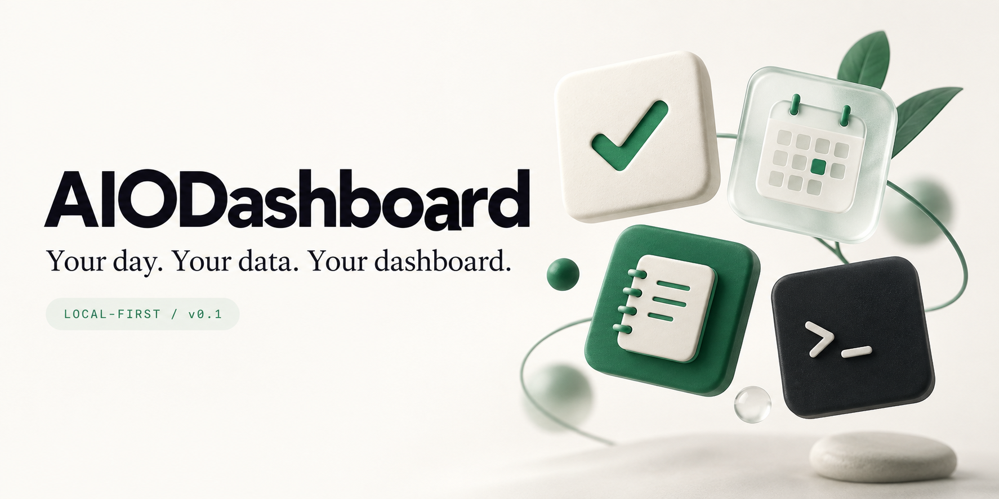
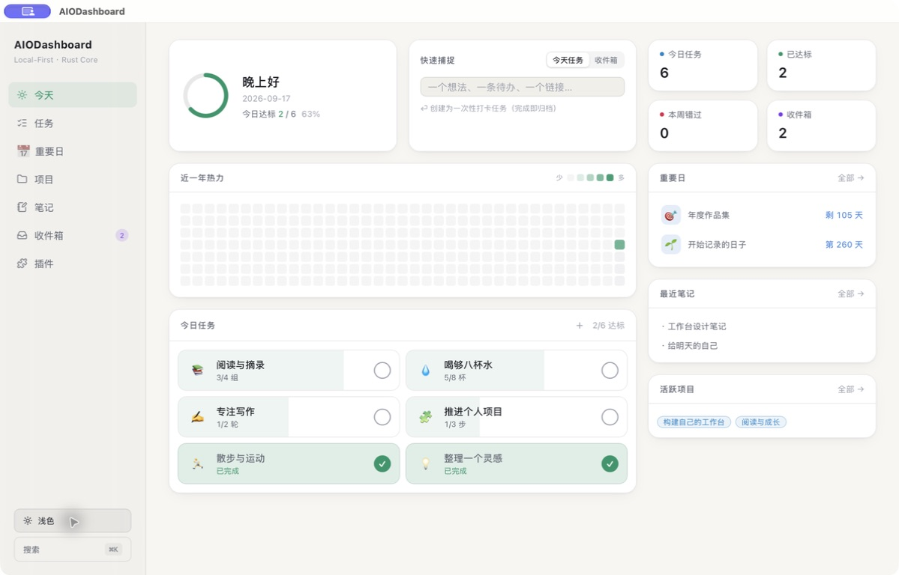
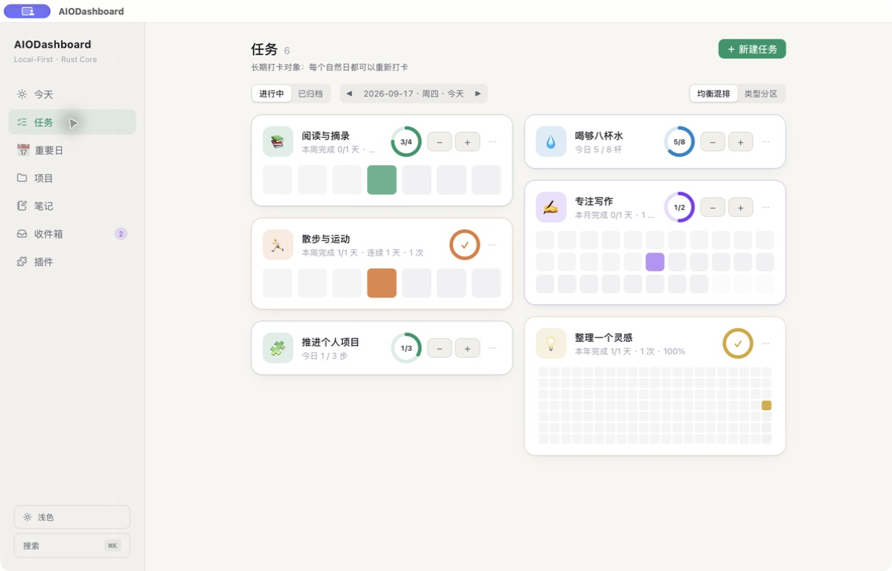
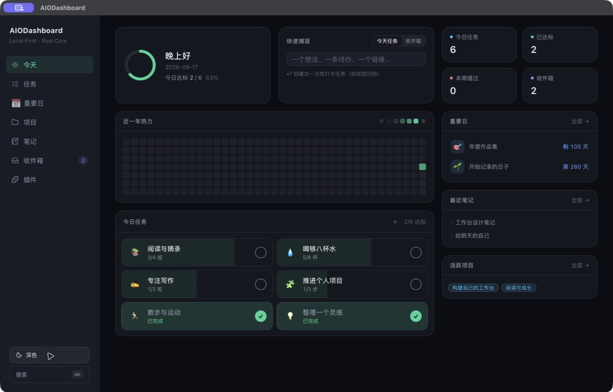

<h1 align="center">AIODashboard</h1>

<strong>把今天、长期目标和灵感，放进自己的工作台。</strong>

本地优先 · macOS 桌面 · 可扩展插件 · 面向 AI 的 JSON CLI

<a href="https://github.com/SuperWheel/AIODashboard/releases/tag/v0.1.0">下载 v0.1.0</a> · <a href="https://superwheel.github.io/AIODashboard/">项目主页</a> · <a href="docs/PLUGIN_API.md">插件开发</a> · <a href="https://github.com/SuperWheel/AIODashboard/issues">反馈问题</a>

   

AIODashboard 是个人 All-in-One Dashboard：用任务打卡积累日常进度，用重要日连接长期目标，用笔记与收件箱接住灵感。数据保存在自己的电脑上，桌面界面与 CLI 共用 Rust Core；AI 工具也能通过结构化命令参与工作。

## 看看它的样子

以下为 **v0.1.0 发行构建的真实界面**，使用独立临时数据库中的演示内容。顶部品牌封面是 AI 生成的概念视觉，不代表软件界面。

| 任务卡片墙 | 深色工作台 |
|---|---|
|  |  |

## 一个工作台，几种进入方式

| 你想做的事 | v0.1.0 提供的能力 |
|---|---|
| 看清今天 | 今日任务、完成率、近一年热力、重要日、最近笔记与活跃项目 |
| 让习惯持续 | 目标次数、循环规则、打卡与撤销、周/月/年总览、星级与拖拽排序 |
| 记住重要日 | 倒计时与纪念日、任务归属、综合热力图 |
| 接住零散信息 | 项目、笔记、收件箱，以及 ⌘K 全局搜索 |
| 添加自己的工具 | ZIP / 文件夹导入、权限审阅、启停、设置、重载；提供开发示例 |
| 让 AI 参与 | 稳定 JSON CLI、今日上下文、幂等打卡、来源标记与活动日志 |

**核心数据无需账号或云端服务。** 网络权限插件可按授权访问声明的域名；本地优先并不意味着所有插件都离线。

## 下载与安装

前往 [v0.1.0 Release](https://github.com/SuperWheel/AIODashboard/releases/tag/v0.1.0)：

- **桌面端**：<code>AIODashboard_0.1.0_aarch64.dmg</code>，适用于 Apple Silicon Mac（M1 及以后）。打开后将应用拖入「应用程序」。
- **CLI**：<code>dashboard_0.1.0_aarch64-apple-darwin.tar.gz</code>，解压后运行 <code>./dashboard --help</code>。
- **校验**：将附件和 <code>SHA256SUMS.txt</code> 放在同一目录，运行 <code>shasum -a 256 -c SHA256SUMS.txt</code>。

本次发行未使用 Apple Developer ID 分发签名，也未经过 Apple 公证。macOS 可能提示无法验证开发者；确认来源和校验和后，按系统「隐私与安全性」中的提示处理。无需关闭系统整体安全保护。Intel Mac、Windows 与 Linux 暂无本次发行的预编译包。

> **早期版本**：升级前退出应用并备份数据目录。v0.1.0 包含数据库 V8 迁移，旧插件会停用，需要迁移 manifest 并重新审阅权限。[完整发行说明](docs/releases/v0.1.0.md)

## 让 AI 和你使用同一份数据

~~~bash
# 查看今天，输出稳定 JSON
dashboard context today --json

# 新建一个每日目标
dashboard task create --title "喝水" --target 8 --unit 杯 --icon "💧" --json

# 用返回的任务 ID 替换占位符；同一 operation-id 重放不重复计数
dashboard task checkin <task-id> --operation-id drink-water-001 --json

# AI 操作留下来源记录
DASHBOARD_ACTOR=ai dashboard task create --title "整理本周笔记" --json
dashboard activity list --actor ai --json
~~~

业务命令支持 <code>--json</code>；信封为 <code>{ success, data, error, meta }</code>，当前 <code>meta.schema_version</code> 为 <code>"6"</code>。退出码：0 成功、1 一般错误、2 参数错误、3 不存在、4 权限拒绝、5 冲突。GUI 会轮询共享数据，展示 CLI 的变更。

AI-Friendly 指可供外部 AI 工具调用的接口；应用没有内置大模型聊天、模型订阅或自动代理执行。

## 按自己的需要扩展

从「插件 → 导入插件」选择 ZIP 或文件夹，查看版本与权限，再确认安装。新装或替换后默认停用，经审阅启用才加载。参考 [插件开发手册](docs/PLUGIN_API.md) 编写自己的扩展。

~~~bash
dashboard plugin new com.example.my-tool --template ts
dashboard plugin dev ./com.example.my-tool
dashboard plugin install ./com.example.my-tool.zip
dashboard plugin safe-mode  # 故障时停用全部插件，随后重启应用
~~~

当前为 **Trusted WebView**：插件与宿主共享 WebView，只运行可信代码；权限检查不等于进程级沙箱。回滚使用 CLI。公共 SDK/test 版本 0.2.0、插件协议 plugin.protocol/v2 与应用版本 0.1.0 分别管理。

番茄钟示例尚未完成，不预装，也不作为本次发行的可用功能。「求职台·试用」示例是演示 UI，重载会恢复样本，不能用于保存真实求职进度。

## 从源码运行

需要 Rust stable、Node.js ≥ 20，以及 macOS Command Line Tools。

~~~bash
git clone https://github.com/SuperWheel/AIODashboard.git
cd AIODashboard
npm ci
npm ci --prefix apps/desktop
npm run tauri dev --prefix apps/desktop

# CLI 与发行构建
cargo build --release -p dashboard-cli
./target/release/dashboard --help
bash scripts/check.sh full
npm run tauri build --prefix apps/desktop
~~~

## 本地数据与架构

- 数据库：<code>~/Library/Application Support/AIODashboard/dashboard.db</code>（SQLite WAL）。
- 插件：默认位于数据库同目录的 <code>plugins/</code>。
- 路径覆盖：<code>DASHBOARD_DB_PATH</code>、<code>DASHBOARD_PLUGINS_DIR</code>、<code>DASHBOARD_WIDGET_SNAPSHOT_PATH</code>。
- Widget Snapshot 已提供文件协议；原生 WidgetKit 小组件尚未交付。

~~~text
React GUI ── Tauri Commands ──┐
                             ├── Rust Core ── Storage ── SQLite
JSON CLI ────────────────────┘       └── Activity Log / Widget Snapshot
~~~

| 路径 | 职责 |
|---|---|
| crates/dashboard-domain | 领域模型 |
| crates/dashboard-storage | SQLite 与 Repository，唯一 SQL 层 |
| crates/dashboard-core | GUI / CLI 共用业务规则 |
| crates/dashboard-protocol | JSON 信封与退出码 |
| apps/desktop / apps/cli | 桌面与命令行客户端 |
| packages / examples/plugins | 插件 SDK、测试工具与示例 |

更多：[架构说明](docs/architecture.md) · [开发日志](docs/dev-log.md) · [贡献指南](CONTRIBUTING.md) · [AI 协作约定](AGENTS.md)

## 接下来

- [ ] 原生 macOS WidgetKit 小组件
- [ ] 更完整的 AI 接口与自动化工作流
- [ ] 第三方插件隔离与分发体验
- [ ] Calendar / GitHub / Email 等集成
- [ ] 按实际需求探索跨设备同步

以上为方向，尚未作为 v0.1.0 功能交付。欢迎通过 [Issues](https://github.com/SuperWheel/AIODashboard/issues) 提交问题与使用场景。

## 许可证

[MIT](LICENSE) © 2026 SuperWheel
